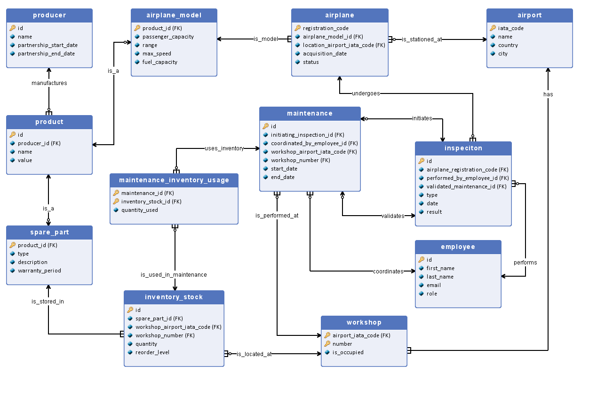

# Airline Maintenance Management Database

A relational database system for medium-sized airlines to manage airplane inspections, maintenance workflows, spare parts inventory, and analytical reporting.

[Database Design Report.pdf](Database%20Design%20Report.pdf) &ndash; detailed documentation including assumptions, limitations, and schema rationale.

## Example Use Cases

- **Inspection-maintenance lifecycle**: Track inspections that trigger maintenance tasks.
- **Inventory tracking**: Monitor spare part usage across workshops.
- **Fleet monitoring**: Airplane history and real-time availability.
- **Analytics**: Complex queries for failure rates, costs, workshop performance, employee workload, etc.

## Database Schema

## SQL Scripts (MS SQL Server)

| Script | Purpose |
|--------|---------|
| [CREATE.sql](CREATE.sql) | Table definitions |
| [INSERT.sql](INSERT.sql) | Sample data population |
| [UPDATE.sql](UPDATE.sql) | Sample update use cases |
| [DELETE.sql](DELETE.sql) | Safe record deletion (all rows) |
| [DROP.sql](DROP.sql) | Schema teardown |
| [SELECT.sql](SELECT.sql) | Sample queries for specific business needs |
| [TRANSACTION.sql](TRANSACTION.sql) | Sample transaction (failed inspection &rarr; book workshop &rarr; start maintenance) |